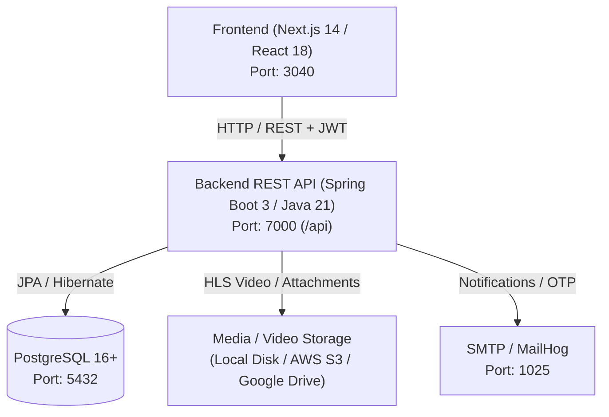

# CareerLabs LMS — Enterprise Learning Management System

[](https://www.oracle.com/java/)
[](https://spring.io/projects/spring-boot)
[](https://nextjs.org/)
[](https://react.dev/)
[](https://www.postgresql.org/)

**CareerLabs LMS** is an enterprise-grade Learning Management and Training Operations platform. Built with a high-performance **Java 21 Spring Boot** REST API, a modern **Next.js 14** web frontend, and a **PostgreSQL** database, it provides role-tailored workspaces for **Super Admins**, **Admins**, **Trainers**, and **Students**.

---

## 🏗️ Architecture & Technology Stack



| Component | Technology | Default Port / URL | Key Responsibilities |
|---|---|---|---|
| **Primary Backend API** | Java 21, Spring Boot 3.3, Spring Security, Hibernate | `http://localhost:7000/api` | Business logic, JWT auth, database persistence, RBAC, scheduler |
| **Frontend Web App** | Next.js 14 (App Router), React 18, Tailwind CSS, Lucide Icons | `http://localhost:3040` | Role-based UI portals, interactive tables, charts, calendar & modals |
| **Primary Database** | PostgreSQL 16+ | `localhost:5432` (`careerlabs_lms`) | Relational data, constraints, indexes, audit timestamps |
| **Video & Asset Storage** | Local Disk / AWS S3 / Google Drive | Configurable via `application.yml` | Secure HLS `.m3u8` video segments, assignment attachments, syllabus files |
| **Mail Service** | SMTP / MailHog | `localhost:1025` | Password reset OTPs, broadcast and alert notifications |

---

## ⚡ Quick Start

### 1. Prerequisites
- **Java 21 JDK** (e.g. OpenJDK / Temurin)
- **Apache Maven 3.9+**
- **Node.js 18+** & **npm 9+**
- **PostgreSQL 16+**

---

### 2. Backend Service Setup (`api`)

1. Ensure your PostgreSQL instance is running and create the database:
   ```sql
   CREATE DATABASE careerlabs_lms;
   ```

2. Configure environment settings in `api/src/main/resources/application.yml` or your shell:
   ```env
   SERVER_PORT=7000
   DB_HOST=localhost
   DB_PORT=5432
   DB_NAME=careerlabs_lms
   DB_USERNAME=postgres
   DB_PASSWORD=your_password
   JWT_SECRET=your_secure_hex_or_base64_jwt_secret_key_minimum_64_bytes
   CORS_ALLOWED_ORIGINS=http://localhost:3000,http://localhost:3040
   ```

3. Run the Spring Boot API:
   ```bash
   cd api
   mvn clean spring-boot:run
   ```
   *The API will be available at `http://localhost:7000/api`.*

4. To run tests:
   ```bash
   mvn test
   ```

---

### 3. Frontend Web Client Setup (`frontend`)

1. Set up your environment in `frontend/.env.local`:
   ```env
   NEXT_PUBLIC_JAVA_API_URL=http://localhost:7000/api
   PORT=3040
   ```

2. Install dependencies and start the development server:
   ```bash
   cd frontend
   npm install
   npm run dev
   ```
   *The web client will be available at `http://localhost:3040`.*

---

## 🔐 Role-Based Access & Demo Credentials

The platform enforces Role-Based Access Control (RBAC) across four roles:
- **SUPERADMIN**: Global system administration, configuration, and auditing.
- **ADMIN**: Academic operations, student/trainer directories, batches, courses, attendance, placements, and reports.
- **TRAINER**: Course content delivery, class attendance marking, assignment evaluation, and quiz authoring.
- **STUDENT**: Self-service portal for enrolled courses, syllabus, live & recorded classes, quizzes, assignments, attendance goals, and placement drives.

| Role | Email | Default Password | Portal Access |
|---|---|---|---|
| **Super Admin** | `superadmin@careerlabs.com` | `ChangeMe123!` | Full Admin Console (`/admin/*`) |
| **Admin** | `admin@careerlabs.com` | `ChangeMe123!` | Operations & Management Console (`/admin/*`) |
| **Trainer** | `trainer@careerlabs.com` | `ChangeMe123!` | Trainer Workspace & Batch Operations (`/admin/*`) |
| **Student** | `student@careerlabs.com` | `ChangeMe123!` | Student Learning Portal (`/student/*`) |

---

## 📦 Core Feature Modules

### 1. Announcements & Broadcast Engine
- **Full Lifecycle**: `DRAFT` $\rightarrow$ `PENDING_APPROVAL` $\rightarrow$ `PUBLISHED` / `SCHEDULED` / `REJECTED`.
- **Dynamic Personalization**: Placeholders (`{{studentName}}`, `{{batchName}}`, `{{courseName}}`, `{{attendancePercentage}}`, `{{date}}`) automatically resolved per recipient.
  - **Multi-Course Resolution**: `{{courseName}}` dynamically resolves and joins all enrolled courses for each student across active enrollments, primary courses, and batch assignments.
- **Audience Filtering**: Broadcast globally, or target specific Batches, Colleges, Courses, or rule-based conditions (`ATTENDANCE_BELOW`, `ASSIGNMENT_NOT_SUBMITTED`, `PLACEMENT_ELIGIBLE`).
- **Live Preview & Comments**: Instant preview of resolved placeholder text; interactive discussion thread for student questions and trainer replies.

### 2. Course Catalog & Multi-Course Enrollment
- **Curriculum Structure**: Hierarchical syllabus modeling (**Courses** $\rightarrow$ **Modules** $\rightarrow$ **Topics** $\rightarrow$ **Sessions**).
- **Multi-Course Enrollments**: Support for students enrolled across multiple active courses (`/api/courses/{id}/enrollments`) with active/inactive state tracking.
- **Conflict Prevention**: Intelligent schedule overlap detection ensures assigned batches and live classes do not conflict with a student's existing schedule.
- **Import & Archival**: CSV / PDF syllabus bulk importer with UTF-8 BOM sanitization and live preview; course deletion safeguards when linked to active batches.

### 3. Attendance Hub & Heatmap Analytics
- **Live "Today's Classes"**: Real-time class session roster for instant attendance marking (`PRESENT`, `ABSENT`, `LATE`, `EXCUSED`).
- **Audit & History**: Detailed audit trail tracking attendance modifications, dates, trainers, and batch history.
- **Student Attendance Health**: Real-time attendance percentage, goal deficit calculator, health status chips, and streak indicators.
- **Correction Workflow**: Student-initiated correction requests with supporting reasons and admin/trainer approval flows.

### 4. Assignments, Task Security & Evaluations
- **Assignment Management**: Rich task briefs, submission deadlines, total marks validation, and batch assignments.
- **Database File Storage**: Secure attachment handling with direct database storage and safe file viewing.
- **Task View Protection**: Built-in screenshot and copy restrictions on designated sensitive task briefs.
- **Grading & Feedback**: Trainer grading workflow with scores, evaluation comments, and status updates.

### 5. Quizzes, Question Banks & Gamification
- **Timed MCQ Engine**: Configurable durations, randomized question orders, and real-time timers.
- **Performance Analytics**: Question-level analytics, weak-topic identification, and class-wide leaderboards.
- **Gamification**: XP points, badges, completion streaks, and milestone achievements.

### 6. Placement & Career Hub
- **Status Tracking**: Student career readiness pipelines (`SEEKING`, `INTERVIEWING`, `PLACED`, `NOT_SEEKING`).
- **Drive Management**: Company drive listings, eligibility criteria checks, student interest submission, and candidate shortlisting.
- **Interactive Resume Builder**: Structured resume creation (Education, Experience, Skills, Projects) with PDF export and direct upload.
- **Mock Interviews**: Interview scheduling, rubric-based feedback, and readiness scoring.

### 7. Recorded Sessions & Live Classes
- **Secure HLS Streaming**: Adaptive video streaming (`.m3u8` / `.ts` segments) protected by short-lived playback tokens.
- **Flexible Storage**: Seamless switching between Local File System, AWS S3 buckets, and Google Drive storage.
- **Live Meeting Links**: Google Meet / Zoom meeting scheduling with timetable collision detection.

---

## 📡 Key API Endpoints Overview

| Area | HTTP & Path | Allowed Roles | Description |
|---|---|---|---|
| **Auth** | `POST /api/auth/login` | Public | Authenticate user & return JWT token |
| **Auth** | `GET /api/auth/me` | Authenticated | Retrieve authenticated user profile |
| **Auth** | `POST /api/auth/forgot-password` | Public | Initiate password reset OTP email |
| **Auth** | `POST /api/auth/verify-otp` | Public | Verify 6-digit OTP |
| **Auth** | `POST /api/auth/reset-password` | Public | Reset password with verified OTP |
| **Announcements**| `GET /api/admin/announcements` | Admin, Trainer | List announcements with status filter |
| **Announcements**| `POST /api/admin/announcements` | Admin, Trainer | Create announcement (draft or published) |
| **Announcements**| `POST /api/admin/announcements/preview-placeholders` | Admin, Trainer | Live preview token substitution |
| **Announcements**| `GET /api/student/announcements` | Student | List eligible personalized announcements |
| **Courses** | `GET /api/courses` | Authenticated | List published courses |
| **Courses** | `GET /api/courses/mine` | Student | List student's enrolled courses |
| **Courses** | `POST /api/courses/{id}/enrollments` | Admin, Trainer | Enroll student in specific course |
| **Attendance** | `GET /api/student/attendance` | Student | Student attendance calendar & metrics |
| **Attendance** | `POST /api/attendance/mark` | Admin, Trainer | Mark attendance for a session roster |
| **Assignments** | `GET /api/student/assignments` | Student | Active assignments & submission status |
| **Assignments** | `POST /api/student/assignments/{id}/submit` | Student | Upload multipart assignment submission |
| **Placement** | `GET /api/student/drives` | Student | View active placement drives & apply |
| **Trainers** | `GET /api/trainers` | Admin, SuperAdmin | Paginated directory of trainers |
| **Students** | `GET /api/students` | Admin, SuperAdmin | Paginated directory of students |

---

## 📁 Repository Structure

```
LMS_craitrix/lms-aug-24/
├── api/                                # Backend (Java 21, Spring Boot 3, Maven)
│   ├── pom.xml                         # Maven dependencies & build configuration
│   └── src/
│       ├── main/java/com/careerlabs/lms/api/
│       │   ├── academic/               # Student academic history (10th/12th/UG/PG)
│       │   ├── announcement/           # Announcements, placeholder resolver, approval workflows
│       │   ├── assignment/             # Assignment definitions, attachments & grading
│       │   ├── attendance/             # Attendance records, alerts, audits & corrections
│       │   ├── auth/                   # JWT generation, authentication & OTP password reset
│       │   ├── batch/                  # Batches, trainer assignment & schedule validation
│       │   ├── college/                # College directory & institution mappings
│       │   ├── config/                 # SecurityConfig, CORS, WebConfig, GoogleOAuth2
│       │   ├── course/                 # Course catalog, syllabus structure & visibility
│       │   ├── dashboard/              # Aggregated dashboard metrics (Student/Trainer/Admin)
│       │   ├── enrollment/             # Student course enrollments & conflict detection
│       │   ├── material/               # Learning assets, documents & notes
│       │   ├── notification/           # Notification dispatching engine
│       │   ├── placement/              # Placement drives, resume builder & mock interviews
│       │   ├── quiz/                   # MCQ player, question bank & leaderboards
│       │   ├── recordedsession/        # HLS video stream encryption & playback tokens
│       │   ├── session/                # Live class timetables & schedule checking
│       │   ├── student/                # Student management service & profile handling
│       │   ├── submission/             # Student assignment submissions & review
│       │   ├── syllabus/               # Syllabus modules, topics, CSV/PDF importers
│       │   ├── trainer/                # Trainer administration & batch allocation
│       │   └── user/                   # User accounts & Role enum (SUPERADMIN, ADMIN, TRAINER, STUDENT)
│       └── main/resources/
│           ├── application.yml         # Application configuration & profiles
│           └── banner.txt              # Spring Boot startup banner
├── frontend/                           # Web Client (Next.js 14 App Router, React 18)
│   ├── package.json                    # Frontend dependencies & scripts
│   ├── next.config.js                  # Next.js configuration & API reverse proxy rewrites
│   └── src/
│       ├── app/
│       │   ├── (admin)/admin/          # Admin & Trainer Console pages
│       │   │   ├── announcements/      # Announcement management & token helper
│       │   │   ├── assignments/        # Assignment creator & submission evaluator
│       │   │   ├── attendance/         # Attendance marker, heatmap & audit log
│       │   │   ├── batches/            # Cohort creation & student batch assignment
│       │   │   ├── course-catalog/     # Curriculum management & syllabus importer
│       │   │   ├── dashboard/          # System-wide KPIs & enrollment metrics
│       │   │   ├── placement/          # Placement drives & drive applicant pipeline
│       │   │   ├── quizzes/            # Quiz maker & question bank editor
│       │   │   ├── recorded-sessions/  # Video uploads & HLS stream manager
│       │   │   ├── students/           # Student directory, filters & CSV export
│       │   │   └── trainers/           # Trainer onboarding & profile manager
│       │   ├── (student)/student/      # Student Learning Portal pages
│       │   │   ├── announcements/      # Feed of personalized notices & comments
│       │   │   ├── assignments/        # Student tasks & file submission uploader
│       │   │   ├── attendance/         # Personal attendance score & goal deficit
│       │   │   ├── dashboard/          # Course progress, upcoming classes & streaks
│       │   │   ├── my-courses/         # Enrolled course viewer & materials
│       │   │   ├── placement/          # Placement drives & resume builder
│       │   │   ├── quizzes/            # Timed MCQ test player & reviews
│       │   │   └── recorded-sessions/  # Streaming video session player
│       │   └── (auth)/                 # Login & OTP password recovery pages
│       ├── components/                 # Reusable UI cards, tables, modals & navigations
│       ├── context/                    # AuthContext & global providers
│       ├── hooks/                      # Custom hooks (e.g. useStudentDashboard)
│       ├── lib/                        # Axios HTTP client & API bindings (`api.js`)
│       └── services/                   # Modular client services (`courseService.js`, etc.)
├── docs/                               # Detailed technical workflows & architecture specs
│   └── LMS_MODULE_WORKFLOWS.md         # Exhaustive module & role workflow documentation
└── README.md                           # Master project guide
```

---

## 📄 License & Maintainer

Maintained by the **CareerLabs Engineering Team**. All rights reserved.
